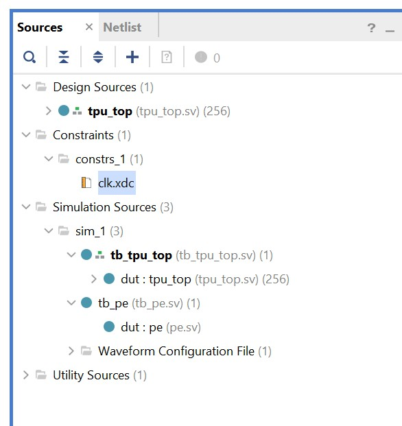
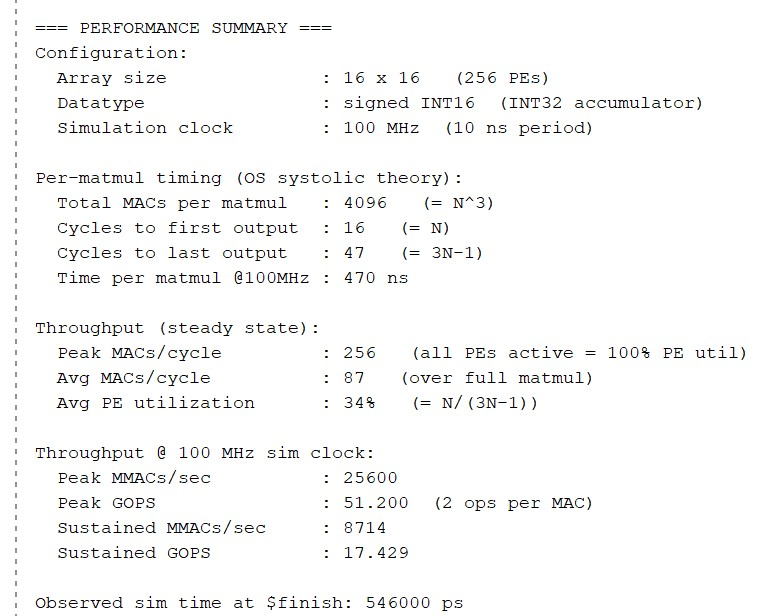
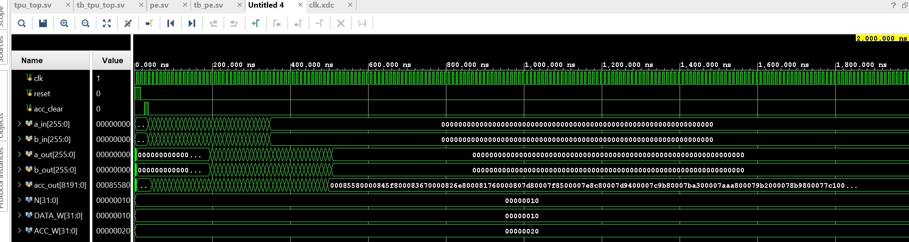
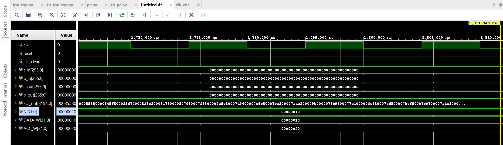
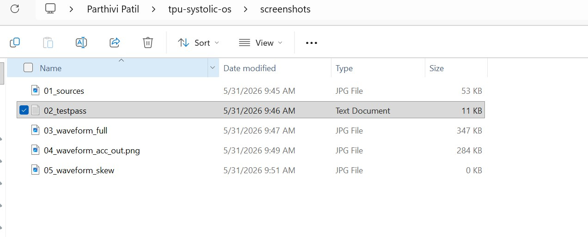

# 16×16 INT16 Output-Stationary Systolic Array TPU

A parameterized SystemVerilog implementation of an output-stationary systolic array TPU for INT16 matrix multiplication, verified in Vivado XSim against a software golden reference and synthesized on Xilinx Artix-7.

**Reference architecture:** NVIDIA Tensor Core dataflow.
**Language:** SystemVerilog (synchronous, active-high reset).
**Target FPGA:** Xilinx Artix-7 XC7A200T (-1 speed grade).

---

## Headline Numbers

| Metric | Value |
|---|---|
| **Array size** | 16×16 (256 INT16 MAC PEs) |
| **Fmax** | **250 MHz** on Artix-7 XC7A200T (-1 grade) — bounded by DSP48E1 silicon |
| **Peak throughput** | **128 GOPS** (64 GMACs/sec) at 250 MHz, 256 MACs/cycle |
| **Sustained throughput** | 43.5 GOPS averaged over a single 16×16 matmul |
| **DSP utilization** | 256 / 740 = **34.6%** |
| **Flip-flops** | 4,191 / 269,200 = 1.56% |
| **LUTs** | 727 / 134,600 = 0.54% |
| **Compute latency** | 47 cycles (= 3N−1, matches OS systolic theory) |
| **Verification** | All 256 outputs bit-exact vs software golden |
| **Timing closure** | Setup WNS +1.94 ns, Hold WHS +0.08 ns, PW WPWS +0.12 ns |

---

## Architecture

| Spec | Value |
|---|---|
| Array size (parameter `N`) | 16×16 (also tested at 4×4) |
| Dataflow | Output-Stationary |
| Data type (inputs) | signed INT16 |
| Accumulator | signed INT32 |
| Reset | synchronous, active-high |
| Target device | Xilinx Artix-7 XC7A200T (-1 speed grade) |
| Synthesis tool | Vivado 2023.1 |
| Simulator | Vivado XSim 2023.1 |

### Processing Element (PE)

Each PE holds an internal 32-bit accumulator (`acc_reg`) that stays stationary. Per cycle:

```
acc_reg <= acc_reg + (a_in * b_in)      // normal MAC
acc_reg <= 0                            // if acc_clear is high
```

Activations flow left→right through a registered pass-through (`a_in → a_out`, 1-cycle delay). Weights flow top→bottom through `b_in → b_out` (1-cycle delay). The pass-through registers create the systolic skew.

### Top-Level Array (`tpu_top`)

256 PEs wired in a 16×16 mesh. Activations enter from the left edge (one per row), weights enter from the top edge (one per column). All 256 accumulators exposed as a packed output `acc_out[8191:0]`.

Packing convention: `acc_out[(i*N+j+1)*32-1 -: 32]` = PE(i,j).

The same RTL parameterizes cleanly from N=4 to N=16 — only the testbench parameter changes.



---

## Verification

### Stimulus

Both matrices filled with `A[i][j] = B[i][j] = i*N + j + 1`.

For the 16×16 case:
```
A = B = [[  1,   2, ...,  16],
         [ 17,  18, ...,  32],
         ...
         [241, 242, ..., 256]]
```

For the 4×4 sanity case (hand-verifiable):
```
A = B = [[ 1,  2,  3,  4],
         [ 5,  6,  7,  8],
         [ 9, 10, 11, 12],
         [13, 14, 15, 16]]

Expected C:
        [[ 90, 100, 110, 120],
         [202, 228, 254, 280],
         [314, 356, 398, 440],
         [426, 484, 542, 600]]
```

### Test methodology

- Self-checking SystemVerilog testbench (`tb_tpu_top.sv`):
  - Computes golden C = A × B in software (nested loop)
  - Drives A from left edge and B from top edge with proper diagonal skew
  - Reads all PE accumulators
  - Compares to golden bit-exactly
- PE-level unit tests (`tb_pe.sv`): 6 directed tests — reset, MAC, clear priority, dot-product, signed math coverage, registered pass-through skew
- Watchdog timer in TB prevents simulator hangs
- Performance instrumentation prints theoretical & observed cycle counts at end of run

### Test output (end of run, 16×16 case)

```
=== ALL 256 OUTPUTS CORRECT - 16x16 MATMUL VERIFIED ===

=== PERFORMANCE SUMMARY ===
Configuration:
  Array size              : 16 x 16   (256 PEs)
  Datatype                : signed INT16  (INT32 accumulator)
  Simulation clock        : 100 MHz  (10 ns period)

Per-matmul timing (OS systolic theory):
  Total MACs per matmul   : 4096   (= N^3)
  Cycles to first output  : 16   (= N)
  Cycles to last output   : 47   (= 3N-1)
  Time per matmul @100MHz : 470 ns

Throughput (steady state):
  Peak MACs/cycle         : 256   (all PEs active = 100% PE util)
  Avg MACs/cycle          : 87    (over full matmul)
  Avg PE utilization      : 34%   (= N/(3N-1))

Throughput @ 100 MHz sim clock:
  Peak MMACs/sec          : 25600
  Peak GOPS               : 51.200
  Sustained MMACs/sec     : 8714
  Sustained GOPS          : 17.429

============================
$finish called at time : 546 ns
```

(At synthesized 250 MHz, the throughput numbers scale by 2.5× → Peak 128 GOPS, Sustained 43.5 GOPS.)



### Waveform — full simulation arc (4×4 case)

Reset → acc_clear → 12 streaming cycles → 3 flush cycles → settled `acc_out`. Total `$finish` at 186 ns.



### Waveform — decoded `acc_out` (4×4 case)

The 512-bit `acc_out` vector at end of simulation. Each 32-bit slice = one PE's accumulator. Reading MSB→LSB: PE(3,3), PE(3,2), ..., PE(0,0).



Decoded values match the expected C matrix:

| Position | Hex | Decimal | PE | Expected |
|:---:|---|---:|:---:|---:|
| 1 (MSB)  | `00000258` | 600 | (3,3) | 600 ✓ |
| 2        | `0000021e` | 542 | (3,2) | 542 ✓ |
| 3        | `000001e4` | 484 | (3,1) | 484 ✓ |
| 4        | `000001aa` | 426 | (3,0) | 426 ✓ |
| ...      | ...        | ... | ...   | ...    |
| 16 (LSB) | `0000005a` | 90  | (0,0) | 90  ✓ |

### Waveform — systolic skew (zoomed)

Zoomed view around 50-100 ns showing `a_in` and `b_in` ramping in with diagonal skew, and `a_out` / `b_out` lagging by exactly one clock period — the 1-cycle hop between PEs that defines the systolic timing.



---

## Synthesis & Timing (Vivado, Artix-7 XC7A200T -1)

### Constraints

```tcl
create_clock -period 4.000 -name clk [get_ports clk]
# 4 ns = 250 MHz; just above DSP48E1 minimum period of 3.884 ns
```

### Utilization (post-synthesis)

| Resource | Used | Available | Util% |
|---|---:|---:|---:|
| DSP48E1 slices | **256** | 740 | **34.6%** |
| Slice Registers (FFs) | 4,191 | 269,200 | 1.56% |
| SRL16E (shift registers) | 480 | 46,200 | 1.04% |
| LUTs | 727 | 134,600 | 0.54% |
| Block RAM | 0 | 365 | 0% |
| BUFG (clock buffer) | 1 | 32 | 3.1% |

Vivado optimized many pass-through flop chains into SRL16E primitives, packing more logic into less area.

### Timing closure (at 250 MHz)

| Check | Slack | Status |
|---|---:|:---:|
| Setup (WNS) | **+1.939 ns** | ✅ MET |
| Hold (WHS) | +0.077 ns | ✅ MET |
| Pulse Width (WPWS) | +0.116 ns | ✅ MET |
| Failing endpoints | 0 / 13,662 | ✅ |

**All timing checks pass at 250 MHz.** Vivado output: *"All user specified timing constraints are met."*

The Fmax ceiling on this device (-1 speed grade) is approximately **257 MHz**, bounded by the DSP48E1 silicon minimum-period of 3.884 ns. The RTL critical path is only 1.256 ns (logic 0.456 + routing 0.800, zero logic levels) — fast enough that the silicon DSP is the limiter, not the design.

---

## File Structure

```
rtl/
  pe.sv               Processing Element (output-stationary)
  tpu_top.sv          16×16 array, packed-vector top-level I/O

tb/
  tb_pe.sv            PE unit tests (6 directed tests)
  tb_tpu_top.sv       Array integration test + perf instrumentation

constraints/
  clk.xdc             250 MHz clock constraint

docs/
  results.md          Numbers cheat-sheet
  session-notes.md    Deep technical notes (architecture decisions, walkthroughs)

screenshots/          Vivado waveform + sources captures
```

---

## Roadmap

- [x] PE design + unit-level verification (6 tests passing)
- [x] 4×4 array wiring + end-to-end matmul verification
- [x] Scale to 16×16 (single parameter change)
- [x] Performance instrumentation in TB
- [x] Vivado synthesis on Artix-7 XC7A200T
- [x] Clock constraint tightening (4 ns / 250 MHz closes cleanly)
- [ ] Python golden + randomized regression (≥1,000 vectors)
- [ ] I/O wrapper for full implementation (current design exposes 8K+ pins for direct debug visibility)
- [ ] DFT add-on: scan chain insertion + ATPG coverage

---

## Why Output-Stationary?

Output-stationary minimizes movement of the widest data signal — the 32-bit partial sum stays inside each PE while the 16-bit activations and weights flow past. This is the same dataflow NVIDIA Tensor Cores use in modern GPUs, and it avoids the weight-load phase that weight-stationary architectures require.

For inference workloads with batched inputs, weight-stationary would be more energy-efficient (weights load once, reused across batch). For general matmul and training, output-stationary minimizes total data movement.

---

## License

MIT — see `LICENSE` file.

## Author

Parthivi Patil — Hardware Engineer
